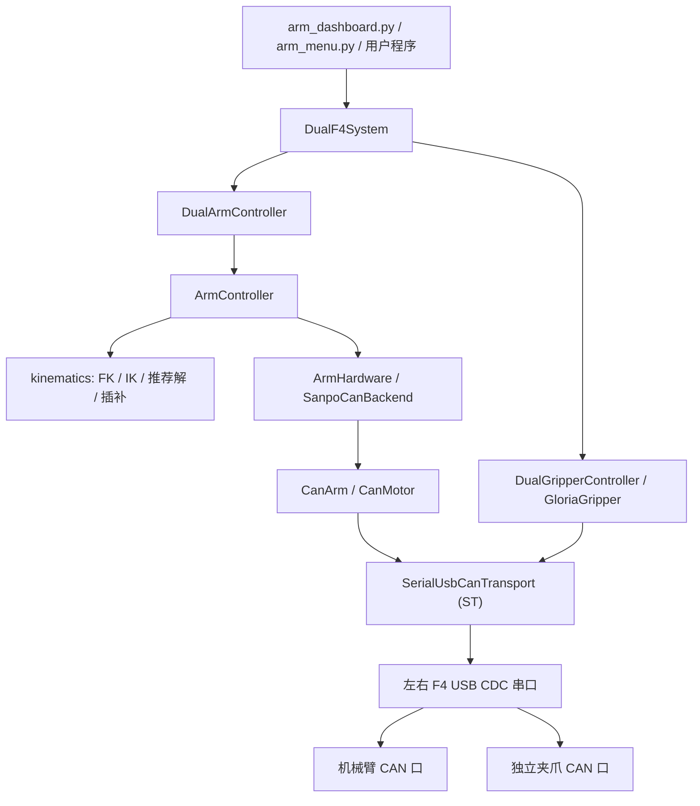

# 项目结构与调用链

本文用于让新维护者快速回答四个问题：

1. 用户输入的坐标最终怎样变成 CAN 命令？
2. 运动学、轨迹、硬件和通信协议分别在哪里？
3. 夹爪为什么不会污染机械臂运控代码？
4. 修改某项参数时应该改哪个文件？

## 1. 总体架构



`DualF4System` 只组合对象和管理两个串口的生命周期。机械臂和夹爪共享同侧
F4 的 USB 串口及事务锁，但绑定不同 CAN Channel。它们没有共同的运动控制类。

## 2. 两条核心调用链

### 2.1 机械臂坐标控制

```text
输入 [X, Y, Z, Pitch, J5]
  -> ArmController.MoveCart / MoveLine
  -> kinematic_5dof.inverse_kinematics
  -> 逻辑关节角 [J1, J2, J3, J4, J5]
  -> 五次关节轨迹或 TCP 直线连续 IK 轨迹
  -> SanpoCanBackend.command_joint_positions
  -> config.py 完成方向、减速比和 J1/J2 硬件映射
  -> CanMotor.position_control_fast
  -> SerialUsbCanTransport.build_standard_packet
  -> ST + Channel + CAN ID + Data + CRLF
  -> F4 -> 机械臂 CAN -> 各关节电机
```

运控逻辑的 J1/J2 与原协议示例的关节编号相反。交换只发生在 `config.py`
硬件适配边界，运动学、轨迹数组、GUI 和反馈都保持统一的逻辑 J1～J5 顺序。

### 2.2 Gloria-M 夹爪控制

```text
输入 0%～100% 开度
  -> GloriaGripper.move_normalized
  -> GripperCalibration 映射为电机 rad
  -> Gloria PV: CAN ID 0x100 + Motor ID
  -> 与机械臂相同的 SerialUsbCanTransport
  -> 同侧 F4 的另一个 Channel
  -> 独立夹爪 CAN 口 -> Gloria-M
```

使能前会把 Gloria-M 运行模式设置为 `POSITION_VELOCITY`，只写运行时寄存器，
不保存 Flash。反馈按 Channel、载荷 Motor ID 和响应类型匹配，并记录实际
Master CAN ID。

## 3. 根目录文件

| 文件 | 作用 | 新维护者何时阅读 |
|---|---|---|
| `README.md` | 功能总览、运控原理、常用 API 和硬件结构 | 第一个阅读 |
| `CHANGELOG.md` | 每个版本的能力、实机验证范围、限制和迁移说明 | 升级或发布前 |
| `pyproject.toml` | 包名、版本、Python 范围、依赖、命令行入口和 setuptools 配置 | 安装或改依赖时 |
| `arm_dashboard.py` | Tkinter 图形控制台，包含连接、双臂、夹爪、理论模型、实时反馈和参数页 | 改 GUI 时 |
| `arm_menu.py` | 轻量命令行菜单，主要用于无 GUI 环境和单臂/协议调试 | Linux 终端调试 |
| `.gitignore` | 排除虚拟环境、缓存、构建物和运行导出数据 | 增加生成文件时 |
| `.gitattributes` | 固定源码换行规则，避免 Windows/Linux 互相制造整文件变更 | 一般无需修改 |

## 4. 文档、脚本和自动化

| 文件 | 作用 |
|---|---|
| `docs/DEPLOYMENT.md` | Windows/Linux 新电脑从零安装、验收、真机接入和故障处理 |
| `docs/PROJECT_STRUCTURE.md` | 当前文件，解释分层、调用链和逐文件职责 |
| `scripts/bootstrap_windows.ps1` | Windows 创建 `.venv`、安装、测试和仿真自检 |
| `scripts/bootstrap_linux.sh` | Linux 创建 `.venv`、安装、测试和仿真自检 |
| `.github/workflows/ci.yml` | GitHub Actions 在 Windows/Ubuntu、Python 3.10/3.12 上安装、测试、自检并构建 wheel |

## 5. 示例程序

| 文件 | 作用 |
|---|---|
| `examples/__init__.py` | 让 examples 可被安装并作为命令入口加载 |
| `examples/dual_arm_gripper_chain.py` | 展示创建双 F4 系统、坐标运动和夹爪动作的完整业务链路 |
| `examples/probe_gloria_can.py` | 只读扫描 Gloria-M Channel 和 Master CAN ID，不使能、不运动 |
| `examples/smoke_test.py` | 安装后仿真自检，验证 GUI/CLI 导入、双臂同步和右夹爪控制对象 |

安装后对应命令：

```text
sanpo-arm-dashboard
sanpo-arm-menu
sanpo-arm-gripper-demo
sanpo-arm-gripper-probe
sanpo-arm-smoke-test
```

## 6. `sanpo_arm_sdk/` 顶层

| 文件 | 作用 |
|---|---|
| `sanpo_arm_sdk/__init__.py` | 稳定公共 API 和 `__version__`；业务代码优先从这里导入 |
| `sanpo_arm_sdk/config.py` | 左右臂 Motor ID、方向、减速比、零偏、J1/J2 映射和关节硬限位 |
| `sanpo_arm_sdk/settings.py` | 常调运行参数：默认速度、加速度、采样周期、直线容差、推荐搜索步长和反馈容量 |
| `sanpo_arm_sdk/errors.py` | 统一错误码、异常和中文错误文本 |
| `sanpo_arm_sdk/factory.py` | 创建真机/仿真、单臂/双臂控制器，集中注入硬件后端 |
| `sanpo_arm_sdk/system.py` | 创建双 F4、双臂、双夹爪拓扑，管理共享串口的连接与关闭 |

`config.py` 是硬件标定数据，`settings.py` 是运行偏好。不要把电机 ID、方向或
硬限位放进 `settings.py`。

## 7. `protocol/`

| 文件 | 作用 |
|---|---|
| `protocol/__init__.py` | 导出协议层稳定入口 |
| `protocol/can_motor_arm_lib.py` | USB CDC AT/ST 封包、ST 流解析、共享串口事务锁、Channel 端点、CanMotor 和 CanArm 电机协议 |

这是最底层且风险最高的文件。主要对象：

- `SerialUsbCanTransport`：拥有串口，切换协议模式，收发和解析 USB 帧。
- `CanChannelTransport`：把同一串口绑定到指定 CAN Channel。
- `CanMotor`：单电机使能、失能、状态读取、位置命令和设零。
- `CanArm`：组织一条机械臂的多个电机。

修改报文格式时先补 `tests/test_protocol.py`，再接真机。

## 8. `hardware/`

| 文件 | 作用 |
|---|---|
| `hardware/__init__.py` | 硬件后端包入口 |
| `hardware/base.py` | `ArmHardware` 协议，规定运控层可调用的最小硬件能力 |
| `hardware/can_backend.py` | 把逻辑关节命令转换为 `CanArm/CanMotor` 调用 |
| `hardware/simulated_backend.py` | 内存仿真后端，不开串口，用于测试、预览和新电脑验收 |

更换控制板时优先新增或修改 hardware/protocol 适配，不要让 CAN 字节进入
`motion/`。

## 9. `kinematics/`

| 文件 | 作用 |
|---|---|
| `kinematics/__init__.py` | 导出 FK、IK、推荐解、直线规划和理想模型接口 |
| `kinematics/kinematic_5dof.py` | 五轴正逆运动学、连杆参数、关节范围、Pitch/J5 无解推荐 |
| `kinematics/guiji_quintic.py` | 五次多项式时间律、关节轨迹和点到点笛卡尔目标规划 |
| `kinematics/cartesian_line.py` | TCP 直线采样、连续 IK 分支选择、速度/加速度校验和自动延时 |
| `kinematics/ideal_arm_model.py` | 理想连杆、Base/J1～J5/TCP 坐标系、目标/理论/反馈 TCP 比较和 CSV 导出 |

`kinematic_5dof.py` 中的长度和角度定义必须与实体机械臂标定保持一致。更改后
运行理想模型和运动链测试，并重新做低速实机验证。

## 10. `motion/`

| 文件 | 作用 |
|---|---|
| `motion/__init__.py` | 导出单臂、双臂和预规划结果 |
| `motion/arm_controller.py` | 单臂公共 API：连接、同步、MoveJ、MoveCart、MoveLine、预览、停止和执行采样轨迹 |
| `motion/dual_arm_controller.py` | 双臂预规划、并行开始、共同结束时间、结果聚合和双侧停止 |

`ArmController` 不知道串口和 CAN 报文，只依赖 `ArmHardware`。这条边界是
控制板协议可替换的关键。

## 11. `end_effectors/`

| 文件 | 作用 |
|---|---|
| `end_effectors/__init__.py` | 导出夹爪公共 API |
| `end_effectors/base.py` | `GripperHardware` 接口；以后换 CAN/RS485 夹爪时实现它 |
| `end_effectors/errors.py` | 夹爪连接、通信和配置异常 |
| `end_effectors/models.py` | Gloria 寄存器、控制模式、限制、开合标定、配置和反馈状态 |
| `end_effectors/gloria_protocol.py` | MIT/PV 载荷、专用命令、寄存器载荷和状态解析；不打开串口 |
| `end_effectors/gloria.py` | 单个 Gloria-M 对象，负责状态、使能、失能、清错、设零、模式和寄存器 |
| `end_effectors/dual.py` | 双夹爪并行调用和左右独立错误聚合 |
| `end_effectors/simulated.py` | 仿真夹爪 |
| `end_effectors/unavailable.py` | 表示未安装或禁用的夹爪，让缺失左夹爪不影响双臂 |
| `end_effectors/telemetry.py` | 夹爪采样、峰值、CSV 和图表数据 |

原始实习生 Gloria SDK 已完成协议提取并移除。当前运行时只使用这里的适配器，
不存在第二套串口实现。

## 12. `monitoring/`

| 文件 | 作用 |
|---|---|
| `monitoring/__init__.py` | 反馈监控包入口 |
| `monitoring/telemetry.py` | 机械臂关节角、速度、电流的后台采样、峰值和 CSV 导出 |

采样线程只读取状态，不负责运动规划。高频采样会与控制命令共享 F4 串口事务
锁，调整周期时要观察实际通信负载。

## 13. 测试

| 文件 | 覆盖内容 |
|---|---|
| `tests/test_protocol.py` | AT/ST 报文、流式拆包、Channel 隔离、电机 ID、快速位置命令 |
| `tests/test_motion_chain.py` | 坐标到 IK、轨迹、仿真硬件的单臂完整链路 |
| `tests/test_dual_line_telemetry.py` | 双臂共同时间、TCP 直线、推荐解、反馈峰值和 CSV |
| `tests/test_ideal_arm_model.py` | 连杆长度、坐标系正交右手性、FK 一致性和误差导出 |
| `tests/test_gripper_integration.py` | Gloria 编码、反馈识别、PV 模式、设零确认、双 Channel 和可选夹爪 |

测试全部使用仿真对象或内存串口，不会连接真机。

## 14. 常见修改入口

| 修改目标 | 首选文件 | 必须回归 |
|---|---|---|
| 电机 ID、方向、减速比、硬限位 | `config.py` | protocol、motion chain、实机低速 |
| 连杆长度、TCP 偏置、关节运动学范围 | `kinematic_5dof.py` | ideal model、motion chain、实机标定 |
| 默认速度、采样周期、推荐步长 | `settings.py` | dual line、telemetry |
| ST/AT 报文或电机协议 | `can_motor_arm_lib.py` | protocol 全部 |
| 单臂轨迹执行 | `arm_controller.py` | motion chain、dual line |
| 双臂同步策略 | `dual_arm_controller.py` | dual line |
| 新夹爪 | 新增 `end_effectors/<driver>.py` | gripper integration |
| GUI | `arm_dashboard.py` | smoke test、仿真界面 |

## 15. 新维护者建议阅读顺序

1. `README.md`：理解能力边界和三种运动方式。
2. `docs/DEPLOYMENT.md`：在仿真模式完成安装验收。
3. `config.py`：确认这台机器人的真实 ID、方向和限位。
4. `motion/arm_controller.py`：理解公开运动 API。
5. `kinematics/kinematic_5dof.py`：理解五轴 FK/IK 和姿态限制。
6. `hardware/can_backend.py`：看逻辑关节如何到达电机。
7. `protocol/can_motor_arm_lib.py`：最后再进入字节级协议。
8. `end_effectors/`：需要改夹爪时单独阅读。
9. `tests/`：修改前先找到对应行为测试。

任何实机改动都遵循：仿真测试、规划预览、架空低速单臂、短距离双臂、最后
带负载验证。软件停止不能替代硬件急停。
